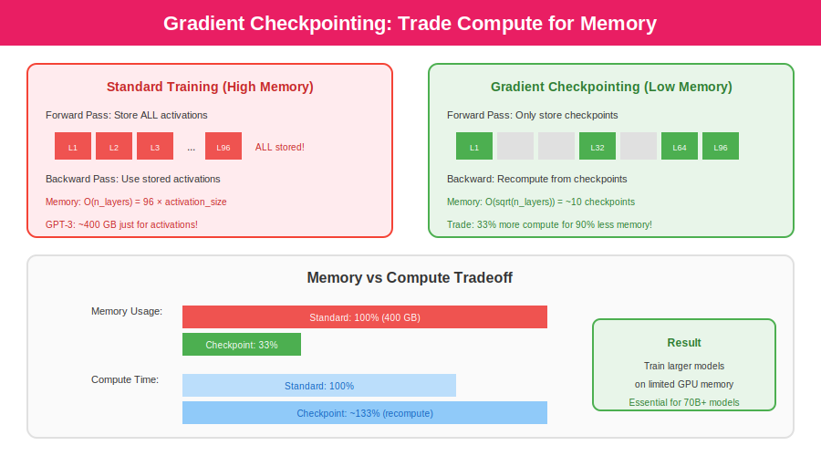
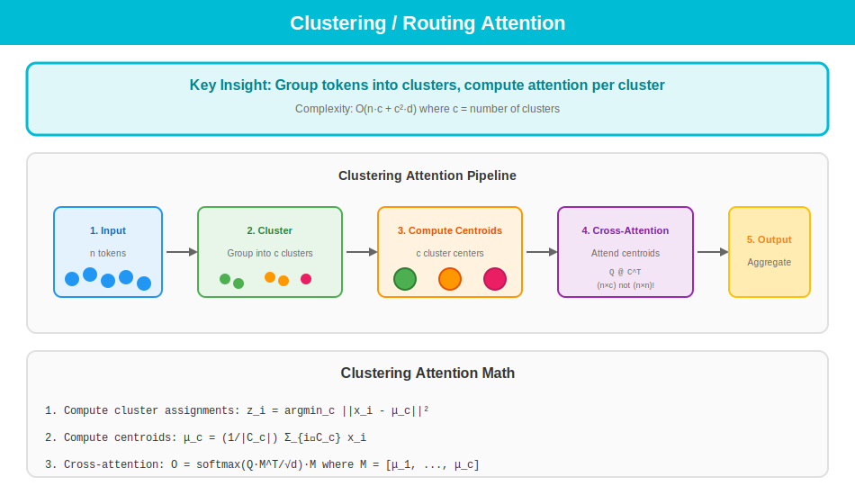

<p align="center">
  
</p>

<p align="center">
  <a href="#-quick-start"></a>
  <a href="#-the-problem"></a>
  <a href="#-the-solution"></a>
  <a href="#-optimizations"></a>
  <a href="#-2025-sota"></a>
</p>

<p align="center">
  
  
  
  
  
</p>

---

## 📍 Visual Learning Path

<p align="center">
  
</p>

<details>
<summary><b>📚 Detailed Table of Contents</b></summary>

1. [🚀 Quick Start](#-quick-start)
2. [⚠️ The Problem: Why We Needed Transformers](#-the-problem)
3. [✅ The Solution: Self-Attention](#-the-solution)
4. [📐 Step-by-Step Math](#-step-by-step-math)
5. [🔧 Key Components Deep Dive](#-key-components)
6. [📈 Evolution Timeline: 2017 → 2025](#-evolution-timeline)
7. [🔄 Architecture Comparisons](#-architecture-comparisons)
8. [💻 Complete Implementation](#-complete-implementation)
9. [⚡ Optimizations](#-optimizations)
10. [📊 Complexity: O(n²) → O(n)](#-complexity-reduction)
11. [🚀 2025 SOTA: Advanced Attention](#-2025-sota)
12. [📖 Further Reading](#-further-reading)

</details>

---

## 🚀 Quick Start

> **TL;DR**: Transformers replaced RNNs by using **self-attention** - allowing every token to directly connect with every other token in parallel.

<table>
<tr>
<td width="50%">

### What You'll Learn

| Topic | Coverage |
|:------|:---------|
| 🧠 **Core Concepts** | Self-attention, Multi-head, QKV |
| 📐 **Mathematics** | Full derivations with examples |
| 🏗️ **Architectures** | 20+ transformer variants |
| ⚡ **Optimizations** | Flash Attention, KV Cache, etc. |
| 🔬 **2025 Research** | GLA, Mamba, KDA, Kimi Linear |

</td>
<td width="50%">

### Who Is This For?

- 🎓 **Students** learning deep learning
- 👨‍💻 **Engineers** implementing transformers
- 🔬 **Researchers** exploring new architectures
- 📊 **ML Practitioners** optimizing models

**Prerequisites**: Basic linear algebra & Python

</td>
</tr>
</table>

---

## ⚠️ The Problem

> **Before 2017**: RNNs processed sequences one token at a time. This was slow and forgot long-range information.

<p align="center">
  
</p>

### Why RNNs Failed for Long Sequences

<table>
<tr>
<td width="33%" align="center">

### 🐌 Sequential

```
Time: O(n)
Can't parallelize!
```

Each step waits for previous

</td>
<td width="33%" align="center">

### 📉 Vanishing Gradients

```
Step 1:  1.0
Step 50: 0.00001
```

Information gets lost

</td>
<td width="33%" align="center">

### 🔗 Long-Range

```
Token 1 ←❌→ Token 1000
```

Hard to connect distant tokens

</td>
</tr>
</table>

### The Math Problem

$$\frac{\partial L}{\partial h_1} = \frac{\partial L}{\partial h_n} \cdot \prod_{t=2}^{n} W_{hh}^T \cdot \text{diag}(\tanh'(z_t))$$

**If** $\|W_{hh}\| < 1$ **→ Gradients vanish exponentially!** After 50+ steps, gradients become nearly zero, making training impossible for long sequences.

---

## ✅ The Solution

> **The Breakthrough**: Self-attention creates **direct paths** between all tokens. No more sequential bottleneck!

<p align="center">
  
</p>

### Self-Attention: Direct Connections

<p align="center">
  
</p>

> **Key Insight**: Every token can directly attend to every other token in **O(1)** path length!

### The Attention Formula

$$\text{Attention}(Q, K, V) = \text{softmax}\left(\frac{QK^T}{\sqrt{d_k}}\right)V$$

**How it works**: Each token creates a Query ("what am I looking for?"), Keys ("what do I contain?"), and Values ("what information do I provide?"). Dot products find relevant matches.

<table>
<tr>
<td width="33%" align="center">
<h4>Query (Q)</h4>
"What am I looking for?"
</td>
<td width="33%" align="center">
<h4>Key (K)</h4>
"What do I contain?"
</td>
<td width="33%" align="center">
<h4>Value (V)</h4>
"What do I offer?"
</td>
</tr>
</table>

---

## 📐 Step-by-Step Math

> **Goal**: Transform input tokens into context-aware representations using learned attention weights.

<p align="center">
  
</p>

### 1️⃣ Create Q, K, V

Project input X through learned weight matrices:

```python
Q = X @ W_Q  # (n, d) @ (d, d_k) = (n, d_k)
K = X @ W_K  # (n, d) @ (d, d_k) = (n, d_k)  
V = X @ W_V  # (n, d) @ (d, d_v) = (n, d_v)
```

### 2️⃣ Compute Attention Scores

Measure similarity between queries and keys. Scale by √d_k for stable gradients:

$$\text{scores} = \frac{QK^T}{\sqrt{d_k}}$$

### 3️⃣ Apply Softmax

Convert scores to probabilities (weights sum to 1):

$$\text{weights} = \text{softmax}(\text{scores})$$

### 4️⃣ Weighted Sum

Aggregate values based on attention weights:

$$\text{output} = \text{weights} \cdot V$$

---

## 🔧 Key Components

### Multi-Head Attention

> **Why multiple heads?** Each head can learn different types of relationships (syntax, semantics, coreference, etc.)

<p align="center">
  
</p>

$$\text{MultiHead}(Q,K,V) = \text{Concat}(\text{head}_1, ..., \text{head}_h)W^O$$

**Example**: 8 heads with d=512 → each head has d_k=64. Parallel attention for richer representations.

### Positional Encoding

> **Problem**: Attention is permutation-invariant. "The cat sat" = "sat cat The" without position info!

<p align="center">
  
</p>

<table>
<tr>
<td width="50%">

#### Sinusoidal (2017)

Fixed encoding using sin/cos waves:

$$PE_{(pos, 2i)} = \sin(pos / 10000^{2i/d})$$
$$PE_{(pos, 2i+1)} = \cos(pos / 10000^{2i/d})$$

</td>
<td width="50%">

#### RoPE (2023+)

Rotary encoding - positions encoded in the attention computation itself:

<p align="center">
  
</p>

</td>
</tr>
</table>

### Feed-Forward Network

> **Role**: Add non-linearity and increase model capacity. Applied identically to each position.

<p align="center">
  
</p>

**Formula**: FFN(x) = W₂ · σ(W₁ · x + b₁) + b₂. Typically expands 4× then projects back.

### Normalization Evolution

> **Why normalize?** Stabilizes training by controlling activation magnitudes.

<p align="center">
  
</p>

**LayerNorm (2017)**: Normalizes mean and variance. **RMSNorm (2023+)**: Only normalizes scale - 10-15% faster!

### Activation Functions

> **Evolution**: ReLU → GELU → SwiGLU. Each improves gradient flow and model quality.

<p align="center">
  
</p>

**SwiGLU**: Used in LLaMA, Mistral. Gated activation with smoother gradients than ReLU.

---

## 📈 Evolution Timeline

> **8 years of progress**: From 65M params (2017) to 1.8T params (2024), with countless architectural improvements.

<p align="center">
  
</p>

### Year-by-Year Block Diagrams

<details>
<summary><b>🔍 2017: Original Transformer</b></summary>

**Key innovations**: Self-attention, encoder-decoder architecture, sinusoidal positions.

<p align="center">
  
</p>

</details>

<details>
<summary><b>🔍 2018: BERT & GPT</b></summary>

**BERT**: Encoder-only, bidirectional, masked LM. **GPT**: Decoder-only, autoregressive.

<p align="center">
  
</p>

</details>

<details>
<summary><b>🔍 2020: GPT-3 & Scaling</b></summary>

**Discovery**: Scaling laws! More params + data = better performance. 175B parameters.

<p align="center">
  
</p>

</details>

<details>
<summary><b>🔍 2023: LLaMA & Mistral</b></summary>

**Improvements**: RMSNorm, RoPE, SwiGLU, GQA. Efficient at scale.

<p align="center">
  
</p>

</details>

<details>
<summary><b>🔍 2024-2025: Modern Architectures</b></summary>

**Cutting edge**: MoE, MLA, sliding window, linear attention hybrids.

<p align="center">
  
</p>

</details>

---

## 🔄 Architecture Comparisons

> **Three paradigms**: Encoder-only (BERT), Decoder-only (GPT), Encoder-Decoder (T5).

<p align="center">
  
</p>

### Encoder vs Decoder

**Encoder**: Bidirectional, sees all tokens. Great for understanding (classification, NER).
**Decoder**: Causal, sees only past. Great for generation (text, code).

<p align="center">
  
</p>

### Mixture of Experts

> **MoE**: Route tokens to specialized "expert" networks. Only 2-4 experts active per token = massive model, efficient compute.

<p align="center">
  
</p>

**Example**: Mixtral 8x7B has 47B params but only uses 13B per forward pass!

---

## 💻 Complete Implementation

> **Full PyTorch implementation** of multi-head attention in ~30 lines.

```python
import torch
import torch.nn as nn
import torch.nn.functional as F
import math

class MultiHeadAttention(nn.Module):
    def __init__(self, d_model, n_heads):
        super().__init__()
        self.d_model = d_model
        self.n_heads = n_heads
        self.d_k = d_model // n_heads
        
        self.W_q = nn.Linear(d_model, d_model)
        self.W_k = nn.Linear(d_model, d_model)
        self.W_v = nn.Linear(d_model, d_model)
        self.W_o = nn.Linear(d_model, d_model)
    
    def forward(self, x, mask=None):
        batch_size, seq_len, _ = x.shape
        
        # Project to Q, K, V
        Q = self.W_q(x).view(batch_size, seq_len, self.n_heads, self.d_k).transpose(1, 2)
        K = self.W_k(x).view(batch_size, seq_len, self.n_heads, self.d_k).transpose(1, 2)
        V = self.W_v(x).view(batch_size, seq_len, self.n_heads, self.d_k).transpose(1, 2)
        
        # Scaled dot-product attention
        scores = torch.matmul(Q, K.transpose(-2, -1)) / math.sqrt(self.d_k)
        
        if mask is not None:
            scores = scores.masked_fill(mask == 0, float('-inf'))
        
        attn_weights = F.softmax(scores, dim=-1)
        output = torch.matmul(attn_weights, V)
        
        # Concatenate and project
        output = output.transpose(1, 2).contiguous().view(batch_size, seq_len, self.d_model)
        return self.W_o(output)
```

---

## ⚡ Optimizations

> **Problem**: Standard attention is O(n²) in memory. For 32K tokens, that's 1 billion attention values!

<p align="center">
  
</p>

### Flash Attention

> **Key idea**: Compute attention in tiles that fit in GPU SRAM. Same math, 2-4× faster, O(n) memory!

<p align="center">
  
</p>

### KV Cache

> **For inference**: Cache computed K,V from previous tokens. Avoids recomputation during autoregressive generation.

<p align="center">
  
</p>

**Trade-off**: Memory vs speed. 7B model at 4K context ≈ 1GB KV cache!

### Quantization

> **Compress weights**: FP16 → INT8 → INT4. 4× smaller, ~5% quality loss.

<p align="center">
  
</p>

### Speculative Decoding

> **Faster generation**: Small "draft" model proposes tokens, large model verifies in parallel. 2-3× speedup!

<p align="center">
  
</p>

### Gradient Checkpointing

> **Training memory**: Don't store all activations. Recompute during backward pass. Trade compute for memory.

<p align="center">
  
</p>

---

## 📊 Complexity Reduction

> **The holy grail**: Reduce O(n²) attention to O(n) while maintaining quality.

<p align="center">
  
</p>

### Sparse Attention Patterns

> **Idea**: Don't attend to everything. Use local windows + global tokens.

<p align="center">
  
</p>

**Sliding Window**: Only attend to nearby tokens (Mistral uses w=4096).
**Longformer**: Local + global [CLS] tokens.

### Linear / Kernel Attention

> **Key trick**: Reorder matrix multiplication! (QK^T)V → Q(K^TV) changes O(n²) to O(n).

<p align="center">
  
</p>

$$\text{softmax}(QK^T) \approx \phi(Q)\phi(K)^T$$

### Low-Rank Attention (Linformer)

> **Insight**: Attention matrix is approximately low-rank. Project to k dimensions where k << n.

<p align="center">
  
</p>

### LSH / Hash Attention

> **Reformer**: Use locality-sensitive hashing to find similar tokens. Only attend within hash buckets.

<p align="center">
  
</p>

### Clustering Attention

> **Group tokens**: Cluster similar tokens, attend to cluster centroids instead of all tokens.

<p align="center">
  
</p>

---

## 🚀 2025 SOTA

> **Latest research**: Linear attention that matches or beats full attention!

<p align="center">
  
</p>

### Delta Rule & DeltaNet

> **Problem with linear attention**: Memory never forgets. **Solution**: Subtract old before adding new!

<p align="center">
  
</p>

$$S_t = S_{t-1} + k_t \beta_t (v_t - S_{t-1}^T k_t)^T$$

### Gated Linear Attention (GLA)

> **Like LSTM for attention**: Add learnable forget gates to control memory retention.

<p align="center">
  
</p>

$$S_t = G_t \odot S_{t-1} + k_t \otimes v_t$$

### Multi-Head Latent Attention (MLA)

> **DeepSeek innovation**: Compress KV to low-rank latent space. Cache the compressed representation.

<p align="center">
  
</p>

**Result**: 8× KV cache compression with minimal quality loss!

### State Space Models (Mamba)

> **No attention at all!** Replace with selective state space: h'(t) = Ah(t) + Bx(t)

<p align="center">
  
</p>

$$h'(t) = Ah(t) + Bx(t)$$
$$y(t) = Ch(t)$$

**O(n) time, O(1) state per step!** But struggles with exact recall tasks.

### Hybrid Architectures (Kimi Linear)

> **Best of both worlds**: 75% linear attention (fast) + 25% full attention (quality).

<p align="center">
  
</p>

From [Kimi Linear Paper (arXiv:2510.26692)](https://arxiv.org/pdf/2510.26692):

| Metric | Full MLA | Kimi Linear |
|:-------|:---------|:------------|
| MMLU-Pro | 49.2 | **51.0** (+1.8) |
| RULER@128K | 81.1 | **84.3** (+3.2) |
| Speed@1M | 1× | **6.3×** |
| KV Cache | 100% | **25%** |

> "For the first time, outperforms full attention under fair comparisons"

---

## 📊 Master Comparison Table

| Method | Time | Memory | Quality | Best For |
|:-------|:-----|:-------|:--------|:---------|
| Standard | O(n²d) | O(n²) | 100% | Short sequences |
| Flash Attention | O(n²d) | **O(n)** | 100% | Training |
| Sliding Window | O(nwd) | O(nw) | ~98% | Long docs |
| Linear/Kernel | O(nd²) | O(nd) | ~95% | Very long |
| Linformer | O(nkd) | O(nk) | ~96% | Fixed compression |
| LSH (Reformer) | O(n log n) | O(n log n) | ~97% | Sparse |
| GLA | O(nd²) | O(nd) | ~98% | Efficient |
| DeltaNet | O(nd²) | O(nd) | ~99% | Quality |
| Mamba | O(nd) | O(d) | ~97% | Speed |
| **KDA (Kimi)** | O(nd²) | O(nd) | **101%+** | **Everything!** |

---

## 📖 Further Reading

### Papers

| Year | Paper | Innovation |
|:-----|:------|:-----------|
| 2017 | [Attention Is All You Need](https://arxiv.org/abs/1706.03762) | Original Transformer |
| 2018 | [BERT](https://arxiv.org/abs/1810.04805) | Bidirectional pre-training |
| 2020 | [GPT-3](https://arxiv.org/abs/2005.14165) | Scale is all you need |
| 2022 | [Flash Attention](https://arxiv.org/abs/2205.14135) | IO-aware attention |
| 2023 | [LLaMA](https://arxiv.org/abs/2302.13971) | Efficient open models |
| 2023 | [Mamba](https://arxiv.org/abs/2312.00752) | Selective SSM |
| 2024 | [GLA](https://arxiv.org/abs/2312.06635) | Gated linear attention |
| 2025 | [Kimi Linear](https://arxiv.org/abs/2510.26692) | KDA + MLA hybrid |

### Code Resources

- 🔥 [Hugging Face Transformers](https://github.com/huggingface/transformers)
- ⚡ [Flash Attention](https://github.com/Dao-AILab/flash-attention)
- 🐍 [Mamba](https://github.com/state-spaces/mamba)
- 🚀 [Kimi Linear](https://github.com/MoonshotAI/Kimi-Linear)

---

<p align="center">

### 🌟 Star this repo if you found it helpful!

**Made with ❤️ for the ML community**

<a href="#-quick-start"></a>

</p>

---

<p align="center">
  <sub>📝 Last updated: December 2025 | 📧 Contributions welcome!</sub>
</p>
