<p align="center">
  
</p>

<p align="center">
  <a href="#-quick-start"></a>
  <a href="#-the-problem"></a>
  <a href="#-the-solution"></a>
  <a href="#-optimizations"></a>
  <a href="#-2025-sota"></a>
</p>

<br>

<h2 align="center">📍 Learning Roadmap</h2>

<p align="center">
  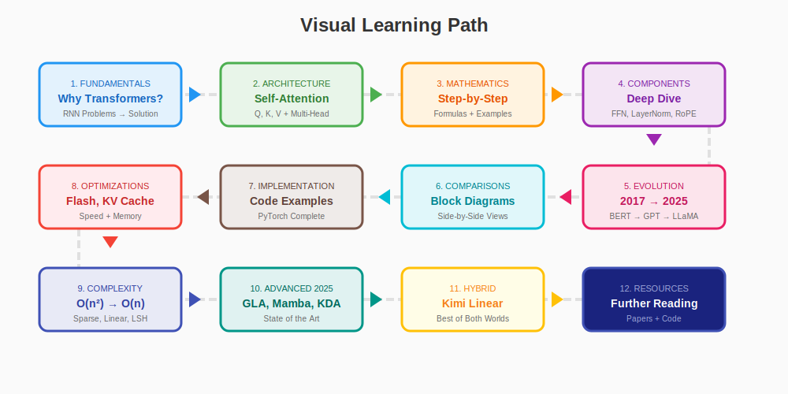
</p>

<details>
<summary align="center"><b>📚 Click to see Detailed Table of Contents</b></summary>
<br>

| # | Section | Description |
|:-:|:--------|:------------|
| 1 | [🚀 Quick Start](#-quick-start) | Overview and prerequisites |
| 2 | [⚠️ The Problem](#-the-problem) | Why RNNs failed |
| 3 | [✅ The Solution](#-the-solution) | Self-attention explained |
| 4 | [📐 Step-by-Step Math](#-step-by-step-math) | Complete derivations |
| 5 | [🔧 Key Components](#-key-components) | Multi-head, FFN, LayerNorm |
| 6 | [📈 Evolution](#-evolution-timeline) | 2017 → 2025 timeline |
| 7 | [🔄 Comparisons](#-architecture-comparisons) | Side-by-side architectures |
| 8 | [💻 Implementation](#-complete-implementation) | PyTorch code |
| 9 | [⚡ Optimizations](#-optimizations) | Flash, KV Cache, Quantization |
| 10 | [📊 Complexity](#-complexity-reduction) | O(n²) → O(n) methods |
| 11 | [🔬 2025 SOTA](#-2025-sota) | GLA, Mamba, Kimi Linear |
| 12 | [📖 Resources](#-further-reading) | Papers & code |

</details>

<br>

---

<br>

<h2 align="center">🚀 Quick Start</h2>

<p align="center">
  <b>TL;DR</b>: Transformers replaced RNNs by using <b>self-attention</b> — allowing every token to directly connect with every other token in parallel.
</p>

<br>

<table>
<tr>
<td width="50%" valign="top">

### 📖 What You'll Learn

| Topic | Coverage |
|:------|:---------|
| 🧠 **Core Concepts** | Self-attention, Multi-head, QKV |
| 📐 **Mathematics** | Full derivations with examples |
| 🏗️ **Architectures** | 20+ transformer variants |
| ⚡ **Optimizations** | Flash Attention, KV Cache, etc. |
| 🔬 **2025 Research** | GLA, Mamba, KDA, Kimi Linear |

</td>
<td width="50%" valign="top">

### 👥 Who Is This For?

| Audience | Benefit |
|:---------|:--------|
| 🎓 **Students** | Learn deep learning fundamentals |
| 👨‍💻 **Engineers** | Implement transformers correctly |
| 🔬 **Researchers** | Explore new architectures |
| 📊 **Practitioners** | Optimize production models |

> **Prerequisites**: Basic linear algebra & Python

</td>
</tr>
</table>

<br>

---

<br>

<h2 align="center">⚠️ The Problem</h2>

<p align="center">
  <i>Before 2017: RNNs processed sequences one token at a time — slow and forgetful.</i>
</p>

<br>

<p align="center">
  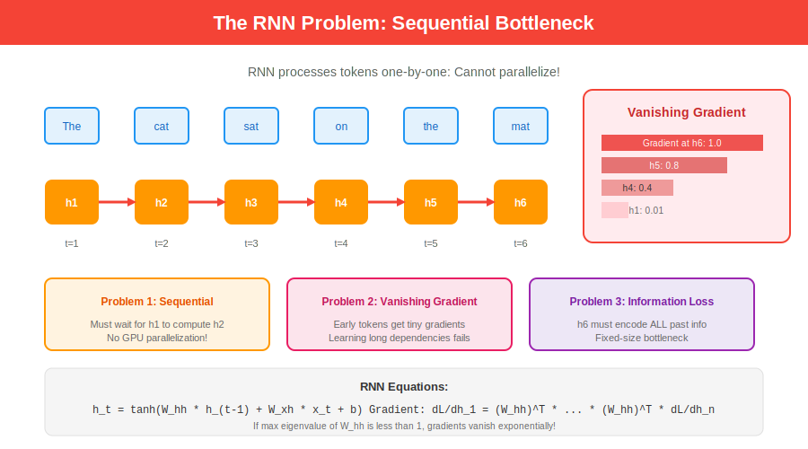
</p>

<br>

<h3 align="center">Why RNNs Failed</h3>

<table>
<tr>
<td width="33%" align="center">
<h4>🐌 Sequential</h4>
<p>Time: <code>O(n)</code><br>Can't parallelize!</p>
<p><i>Each step waits for previous</i></p>
</td>
<td width="33%" align="center">
<h4>📉 Vanishing Gradients</h4>
<p>Step 1: <code>1.0</code><br>Step 50: <code>0.00001</code></p>
<p><i>Information gets lost</i></p>
</td>
<td width="33%" align="center">
<h4>🔗 Long-Range</h4>
<p>Token 1 ↔ Token 1000<br><code>❌ Hard!</code></p>
<p><i>Distant tokens can't connect</i></p>
</td>
</tr>
</table>

<br>

<details>
<summary><b>📐 The Math Behind the Problem</b></summary>
<br>

$$\frac{\partial L}{\partial h_1} = \frac{\partial L}{\partial h_n} \cdot \prod_{t=2}^{n} W_{hh}^T \cdot \text{diag}(\tanh'(z_t))$$

**If** $\|W_{hh}\| < 1$ **→ Gradients vanish exponentially!**

After 50+ steps, gradients become nearly zero, making training impossible.

</details>

<br>

---

<br>

<h2 align="center">✅ The Solution</h2>

<p align="center">
  <b>The Breakthrough</b>: Self-attention creates <b>direct paths</b> between ALL tokens!
</p>

<br>

<p align="center">
  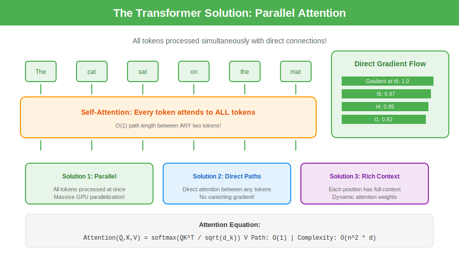
</p>

<br>

<h3 align="center">Self-Attention Mechanism</h3>

<p align="center">
  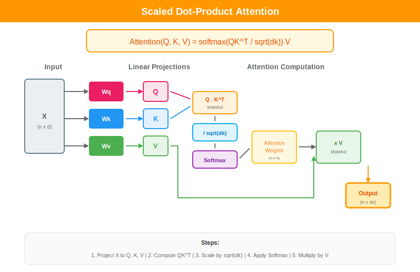
</p>

<br>

<p align="center">
  <b>Key Insight</b>: Every token can directly attend to every other token in <code>O(1)</code> path length!
</p>

<br>

<h3 align="center">The Attention Formula</h3>

<p align="center">

$$\Large \text{Attention}(Q, K, V) = \text{softmax}\left(\frac{QK^T}{\sqrt{d_k}}\right)V$$

</p>

<table>
<tr>
<td width="33%" align="center">
<h4>🔍 Query (Q)</h4>
<p><i>"What am I looking for?"</i></p>
</td>
<td width="33%" align="center">
<h4>🔑 Key (K)</h4>
<p><i>"What do I contain?"</i></p>
</td>
<td width="33%" align="center">
<h4>💎 Value (V)</h4>
<p><i>"What do I offer?"</i></p>
</td>
</tr>
</table>

<br>

---

<br>

<h2 align="center">📐 Step-by-Step Math</h2>

<p align="center">
  <i>Transform input tokens into context-aware representations</i>
</p>

<br>

<p align="center">
  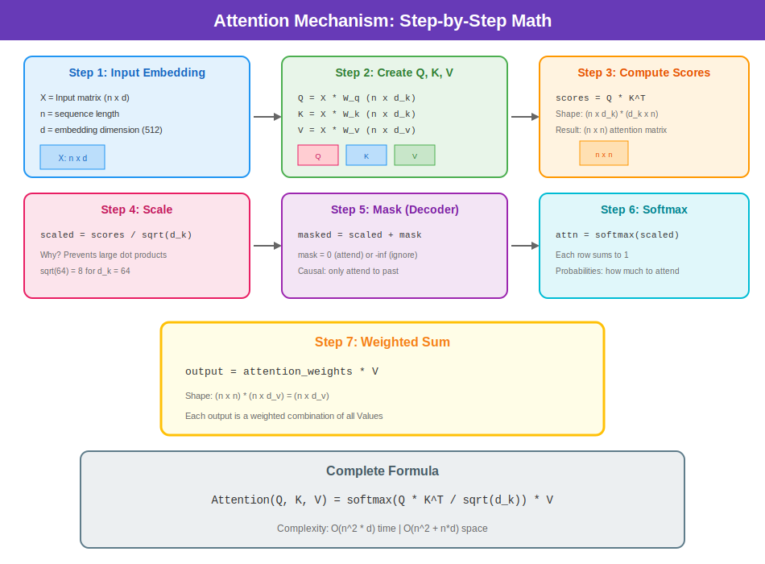
</p>

<br>

<table>
<tr>
<td width="50%">

### Step 1️⃣ Create Q, K, V

```python
Q = X @ W_Q  # (n, d) → (n, d_k)
K = X @ W_K  # (n, d) → (n, d_k)  
V = X @ W_V  # (n, d) → (n, d_v)
```

### Step 2️⃣ Compute Scores

$$\text{scores} = \frac{QK^T}{\sqrt{d_k}}$$

</td>
<td width="50%">

### Step 3️⃣ Apply Softmax

$$\text{weights} = \text{softmax}(\text{scores})$$

*Convert to probabilities (sum = 1)*

### Step 4️⃣ Weighted Sum

$$\text{output} = \text{weights} \cdot V$$

*Aggregate based on attention*

</td>
</tr>
</table>

<br>

---

<br>

<h2 align="center">🔧 Key Components</h2>

<br>

<h3 align="center">Multi-Head Attention</h3>

<p align="center">
  <i>Multiple attention heads learn different relationships</i>
</p>

<p align="center">
  
</p>

<p align="center">

$$\text{MultiHead}(Q,K,V) = \text{Concat}(\text{head}_1, ..., \text{head}_h)W^O$$

</p>

<br>

<h3 align="center">Positional Encoding</h3>

<p align="center">
  <i>Attention is permutation-invariant — we need position info!</i>
</p>

<p align="center">
  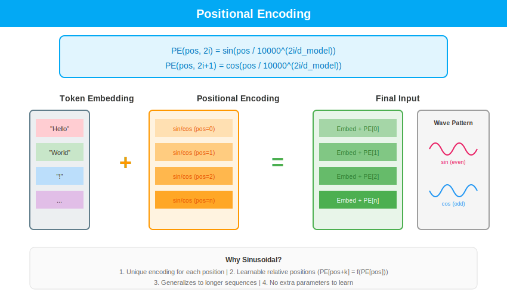
</p>

<table>
<tr>
<td width="50%" align="center">

**Sinusoidal (2017)**

$$PE_{pos, 2i} = \sin(pos / 10000^{2i/d})$$

</td>
<td width="50%" align="center">

**RoPE (2023+)**

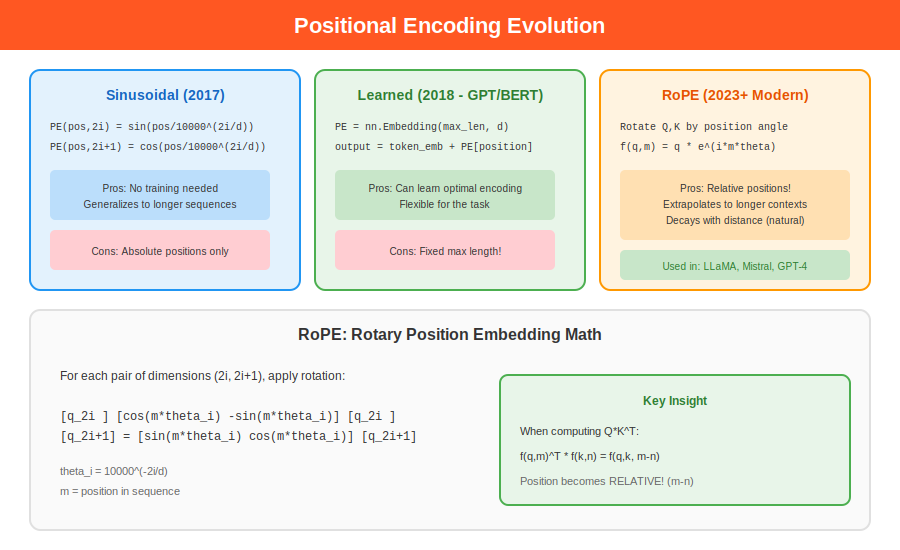

</td>
</tr>
</table>

<br>

<h3 align="center">Feed-Forward & Normalization</h3>

<table>
<tr>
<td width="50%">
<p align="center">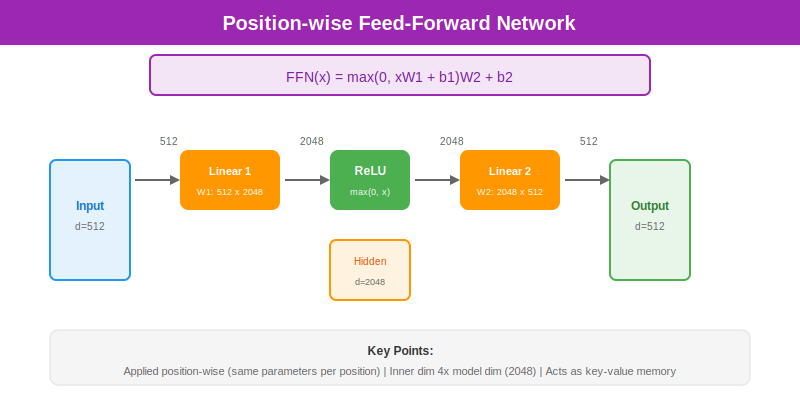</p>
</td>
<td width="50%">
<p align="center">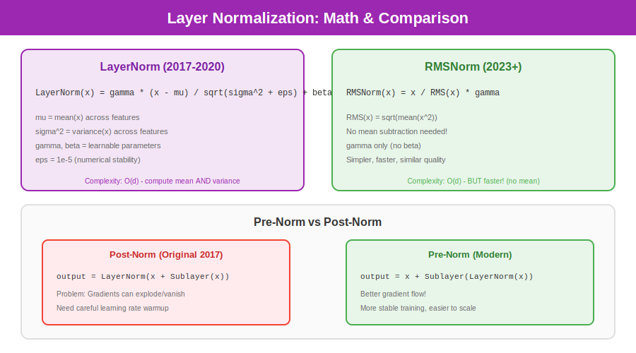</p>
</td>
</tr>
</table>

<br>

<h3 align="center">Activation Functions</h3>

<p align="center">
  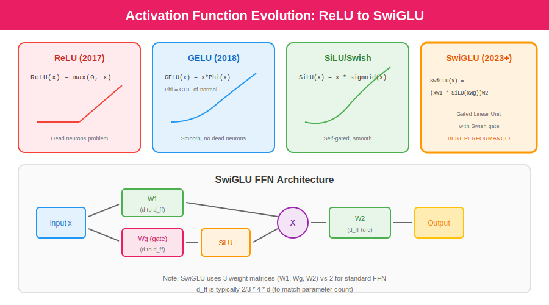
</p>

<br>

---

<br>

<h2 align="center">📈 Evolution Timeline</h2>

<p align="center">
  <i>8 years of progress: 65M → 1.8T parameters</i>
</p>

<br>

<p align="center">
  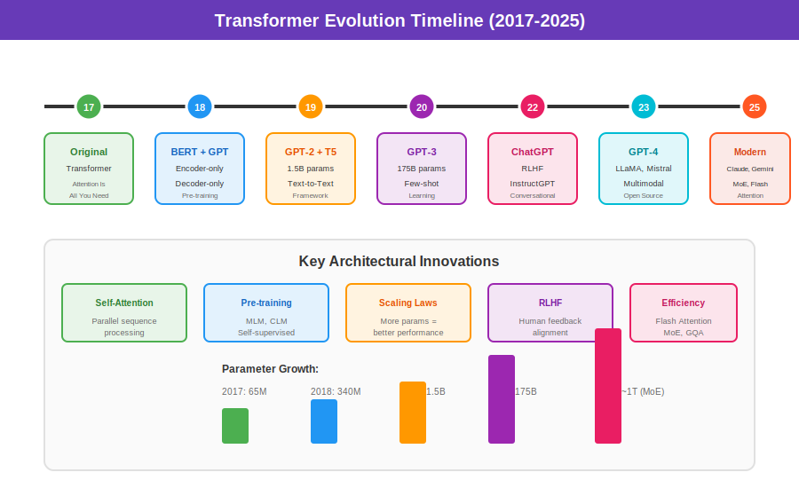
</p>

<br>

<h3 align="center">Year-by-Year Architecture Changes</h3>

<details>
<summary><b>🟢 2017: Original Transformer</b> — Self-attention, Encoder-Decoder</summary>
<br>
<p align="center">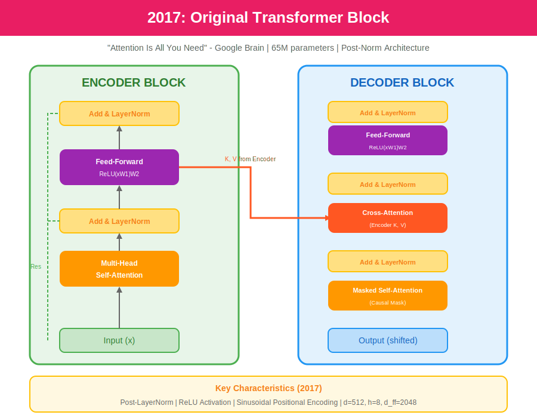</p>
</details>

<details>
<summary><b>🔵 2018: BERT & GPT</b> — Encoder-only vs Decoder-only</summary>
<br>
<p align="center">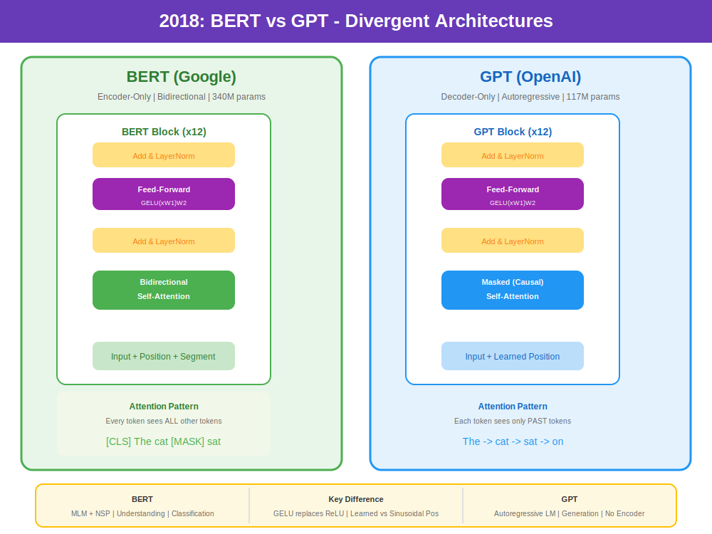</p>
</details>

<details>
<summary><b>🟡 2020: GPT-3</b> — Scale is all you need (175B params)</summary>
<br>
<p align="center">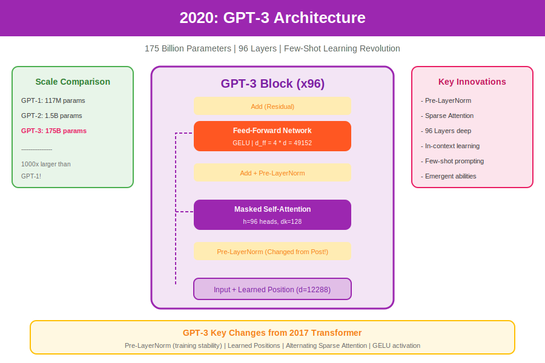</p>
</details>

<details>
<summary><b>🟠 2023: LLaMA & Mistral</b> — RMSNorm, RoPE, SwiGLU, GQA</summary>
<br>
<p align="center">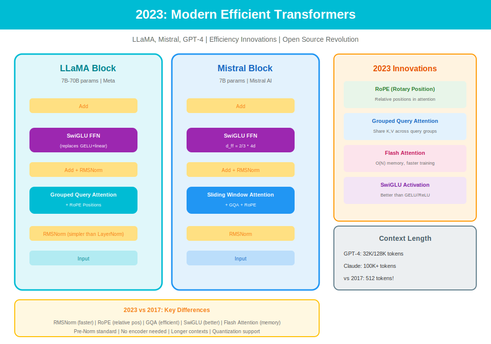</p>
</details>

<details>
<summary><b>🔴 2024-2025: Modern</b> — MoE, MLA, Linear Attention</summary>
<br>
<p align="center">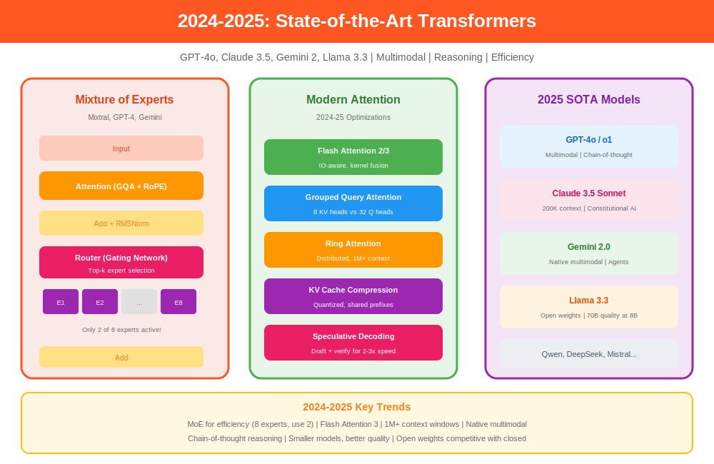</p>
</details>

<br>

---

<br>

<h2 align="center">🔄 Architecture Comparisons</h2>

<p align="center">
  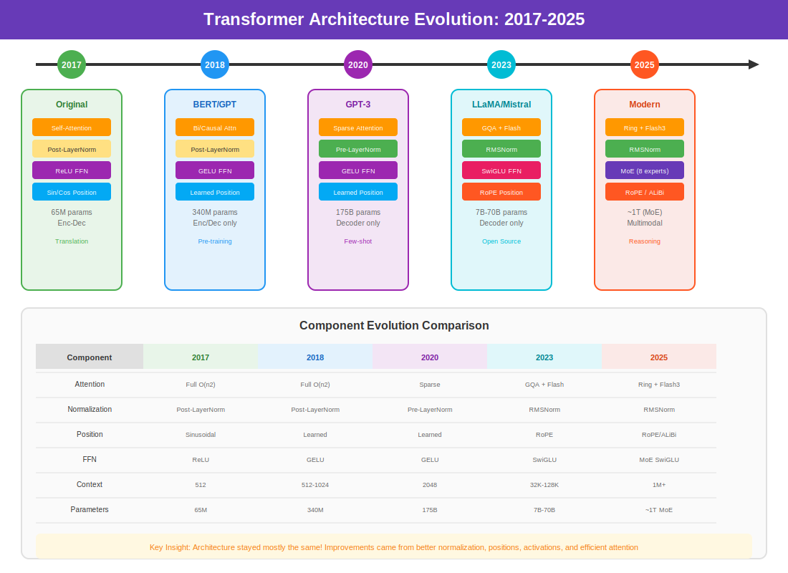
</p>

<br>

<table>
<tr>
<td width="50%">
<h4 align="center">Encoder vs Decoder</h4>
<p align="center">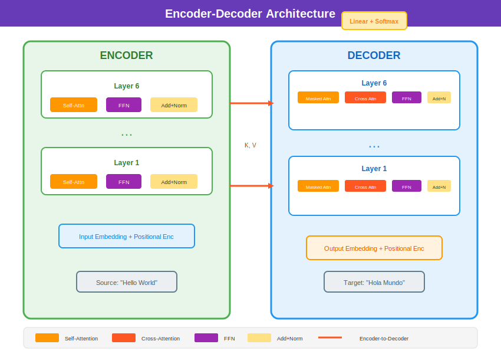</p>
</td>
<td width="50%">
<h4 align="center">Mixture of Experts</h4>
<p align="center">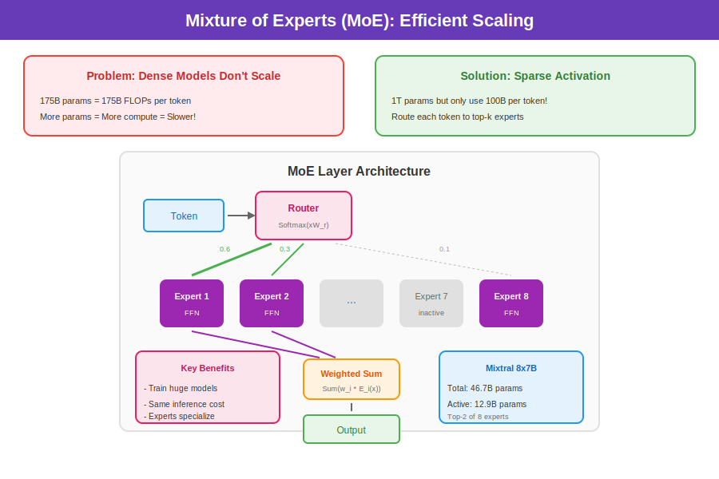</p>
</td>
</tr>
</table>

<br>

---

<br>

<h2 align="center">💻 Complete Implementation</h2>

<p align="center">
  <i>Multi-Head Attention in ~30 lines of PyTorch</i>
</p>

<br>

```python
import torch
import torch.nn as nn
import torch.nn.functional as F
import math

class MultiHeadAttention(nn.Module):
    def __init__(self, d_model, n_heads):
        super().__init__()
        self.n_heads = n_heads
        self.d_k = d_model // n_heads
        
        self.W_q = nn.Linear(d_model, d_model)
        self.W_k = nn.Linear(d_model, d_model)
        self.W_v = nn.Linear(d_model, d_model)
        self.W_o = nn.Linear(d_model, d_model)
    
    def forward(self, x, mask=None):
        B, N, _ = x.shape
        
        # Project and reshape: (B, N, H, D) -> (B, H, N, D)
        Q = self.W_q(x).view(B, N, self.n_heads, self.d_k).transpose(1, 2)
        K = self.W_k(x).view(B, N, self.n_heads, self.d_k).transpose(1, 2)
        V = self.W_v(x).view(B, N, self.n_heads, self.d_k).transpose(1, 2)
        
        # Scaled dot-product attention
        scores = (Q @ K.transpose(-2, -1)) / math.sqrt(self.d_k)
        if mask is not None:
            scores = scores.masked_fill(mask == 0, float('-inf'))
        
        attn = F.softmax(scores, dim=-1)
        out = (attn @ V).transpose(1, 2).contiguous().view(B, N, -1)
        
        return self.W_o(out)
```

<br>

---

<br>

<h2 align="center">⚡ Optimizations</h2>

<p align="center">
  <i>Make transformers faster and more memory-efficient</i>
</p>

<br>

<p align="center">
  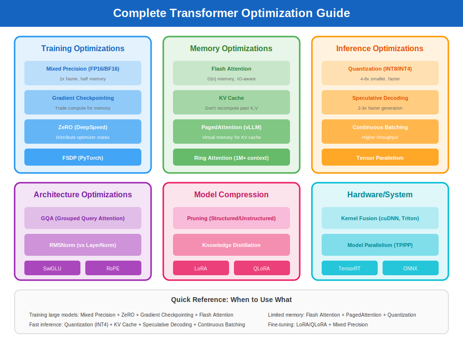
</p>

<br>

<table>
<tr>
<td width="50%">
<h4 align="center">⚡ Flash Attention</h4>
<p align="center">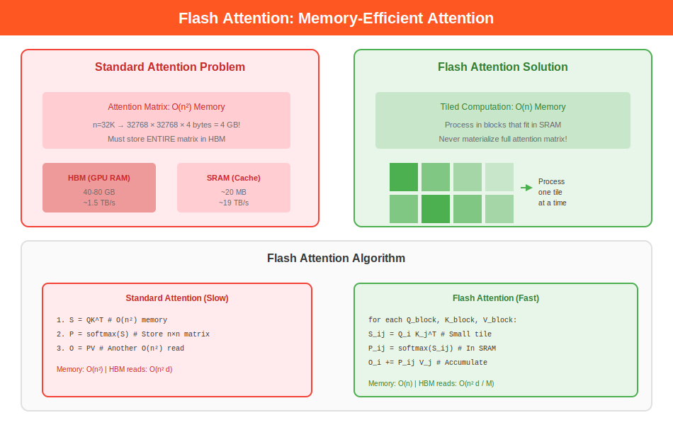</p>
<p align="center"><i>Same math, 2-4× faster, O(n) memory</i></p>
</td>
<td width="50%">
<h4 align="center">💾 KV Cache</h4>
<p align="center">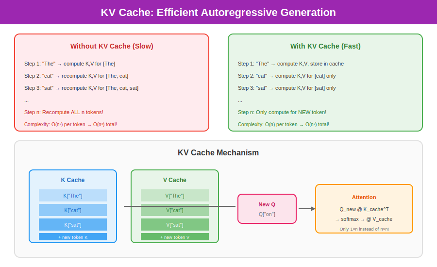</p>
<p align="center"><i>Cache K,V for faster generation</i></p>
</td>
</tr>
<tr>
<td width="50%">
<h4 align="center">📦 Quantization</h4>
<p align="center"></p>
<p align="center"><i>FP16 → INT8 → INT4 (4× smaller)</i></p>
</td>
<td width="50%">
<h4 align="center">🚀 Speculative Decoding</h4>
<p align="center">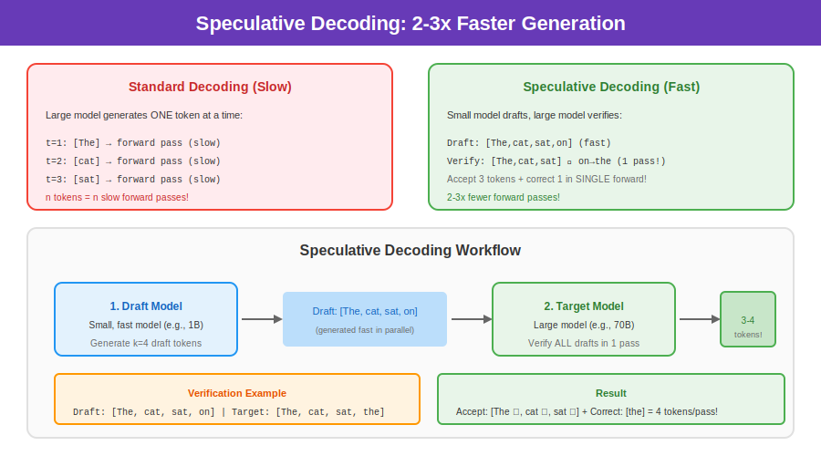</p>
<p align="center"><i>Draft + verify = 2-3× speedup</i></p>
</td>
</tr>
</table>

<br>

---

<br>

<h2 align="center">📊 Complexity Reduction</h2>

<p align="center">
  <b>The Holy Grail</b>: O(n²) → O(n) while maintaining quality
</p>

<br>

<p align="center">
  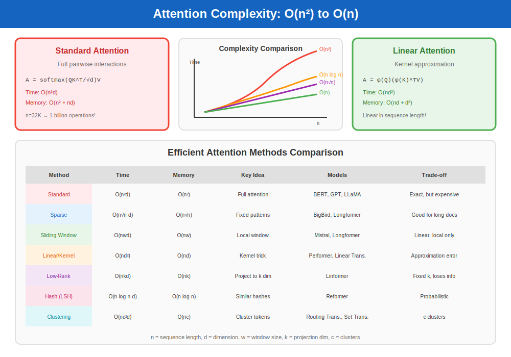
</p>

<br>

<table>
<tr>
<td width="50%">
<h4 align="center">Sparse Attention</h4>
<p align="center">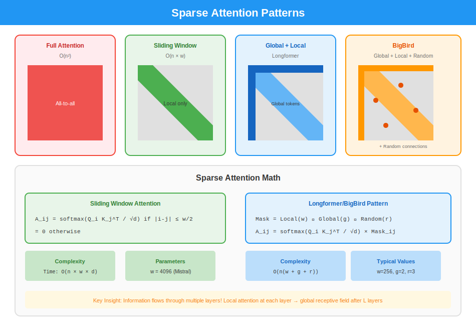</p>
</td>
<td width="50%">
<h4 align="center">Linear Attention</h4>
<p align="center">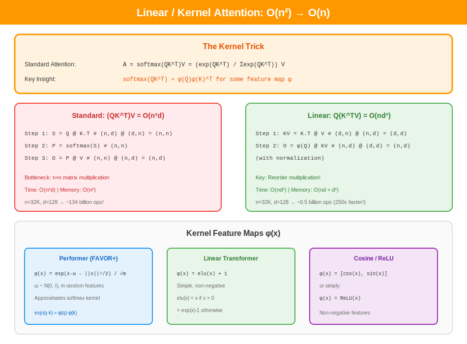</p>
</td>
</tr>
<tr>
<td width="50%">
<h4 align="center">Low-Rank (Linformer)</h4>
<p align="center">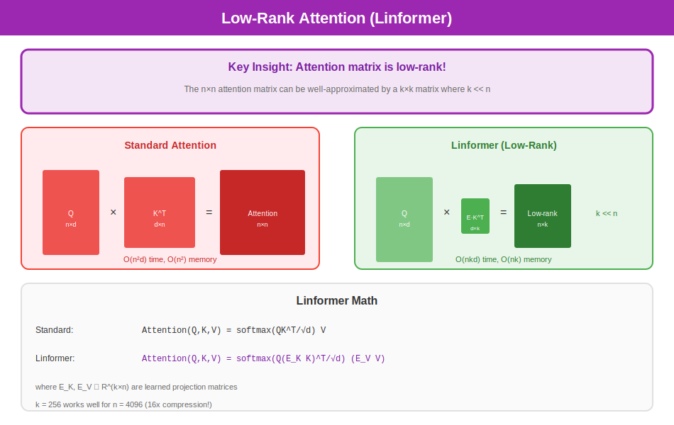</p>
</td>
<td width="50%">
<h4 align="center">LSH (Reformer)</h4>
<p align="center">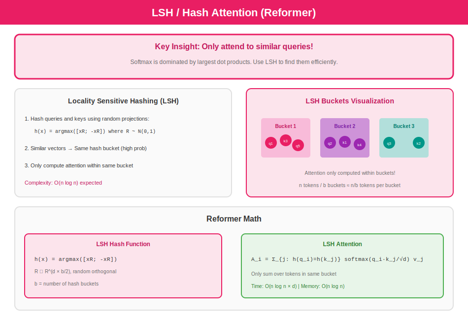</p>
</td>
</tr>
</table>

<br>

---

<br>

<h2 align="center">🔬 2025 SOTA</h2>

<p align="center">
  <i>Latest research: Linear attention that beats full attention!</i>
</p>

<br>

<p align="center">
  
</p>

<br>

<table>
<tr>
<td width="50%">
<h4 align="center">Delta Rule</h4>
<p align="center">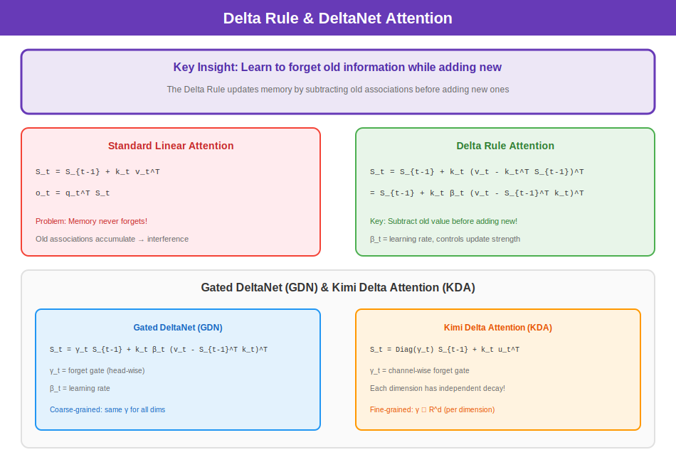</p>
<p align="center"><i>Subtract old before adding new</i></p>
</td>
<td width="50%">
<h4 align="center">Gated Linear (GLA)</h4>
<p align="center">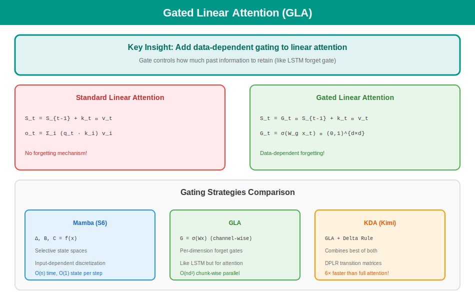</p>
<p align="center"><i>LSTM-style gates for attention</i></p>
</td>
</tr>
<tr>
<td width="50%">
<h4 align="center">MLA (DeepSeek)</h4>
<p align="center">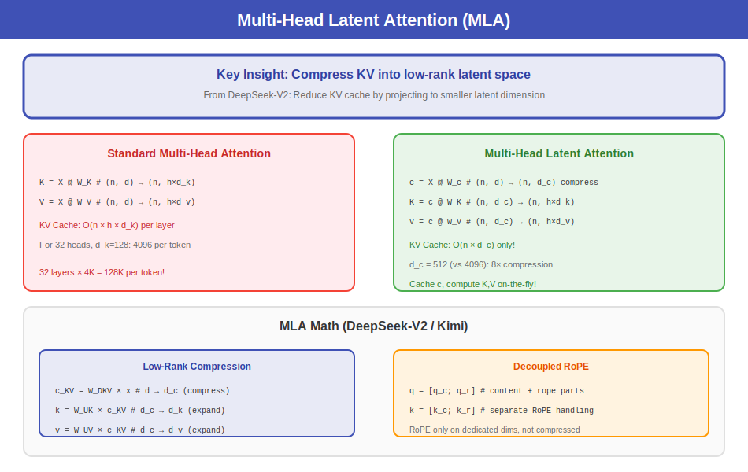</p>
<p align="center"><i>8× KV cache compression</i></p>
</td>
<td width="50%">
<h4 align="center">Mamba (SSM)</h4>
<p align="center">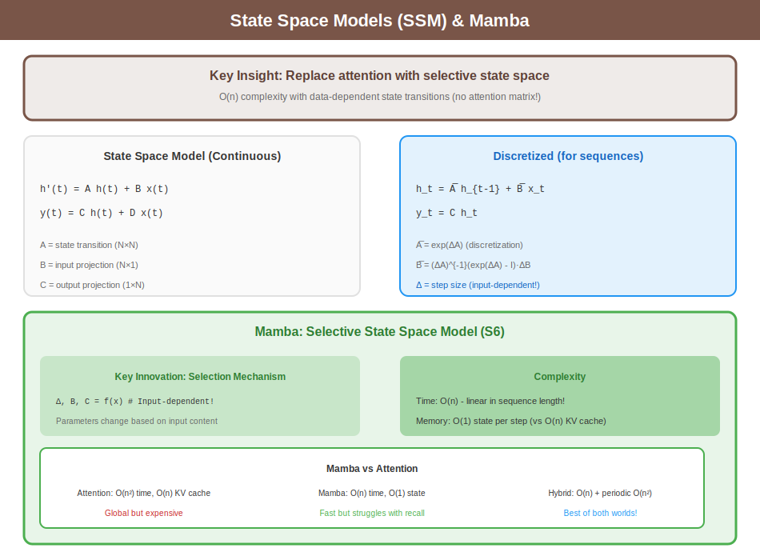</p>
<p align="center"><i>O(n) time, O(1) state</i></p>
</td>
</tr>
</table>

<br>

<h3 align="center">🏆 Hybrid: Kimi Linear</h3>

<p align="center">
  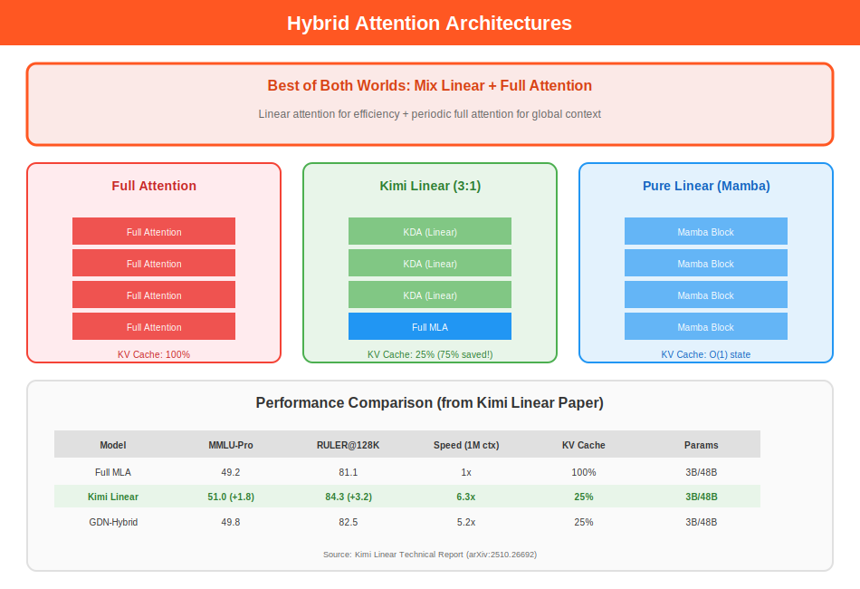
</p>

<p align="center">
  <a href="https://arxiv.org/abs/2510.26692">📄 Paper</a> |
  <b>6.3× faster</b> at 1M context |
  <b>75% less</b> KV cache |
  <b>Better quality</b> than full attention
</p>

<br>

---

<br>

<h2 align="center">📊 Master Comparison</h2>

<br>

| Method | Time | Memory | Quality | Best For |
|:-------|:----:|:------:|:-------:|:---------|
| Standard | O(n²d) | O(n²) | 100% | Short sequences |
| **Flash Attention** | O(n²d) | **O(n)** | 100% | Training |
| Sliding Window | O(nwd) | O(nw) | ~98% | Long documents |
| Linear/Kernel | O(nd²) | O(nd) | ~95% | Very long |
| GLA | O(nd²) | O(nd) | ~98% | Efficient |
| Mamba | O(nd) | O(d) | ~97% | Speed |
| **KDA (Kimi)** | O(nd²) | O(nd) | **101%+** | **Everything!** |

<br>

---

<br>

<h2 align="center">📖 Further Reading</h2>

<br>

<table>
<tr>
<td width="50%">

### 📄 Key Papers

| Year | Paper | Innovation |
|:----:|:------|:-----------|
| 2017 | [Attention Is All You Need](https://arxiv.org/abs/1706.03762) | Original |
| 2018 | [BERT](https://arxiv.org/abs/1810.04805) | Bidirectional |
| 2020 | [GPT-3](https://arxiv.org/abs/2005.14165) | Scale |
| 2022 | [Flash Attention](https://arxiv.org/abs/2205.14135) | IO-aware |
| 2023 | [LLaMA](https://arxiv.org/abs/2302.13971) | Efficient |
| 2023 | [Mamba](https://arxiv.org/abs/2312.00752) | SSM |
| 2023 | [SURVEY ON APPLICATIONS OF TRANSFORMERS](https://arxiv.org/pdf/2306.07303)|APPLICATIONS|
| 2025 | [Kimi Linear](https://arxiv.org/abs/2510.26692) | Hybrid |


</td>
<td width="50%">

### 💻 Code Resources

| Resource | Link |
|:---------|:-----|
| 🤗 Transformers | [GitHub](https://github.com/huggingface/transformers) |
| ⚡ Flash Attention | [GitHub](https://github.com/Dao-AILab/flash-attention) |
| 🐍 Mamba | [GitHub](https://github.com/state-spaces/mamba) |
| 🚀 Kimi Linear | [GitHub](https://github.com/MoonshotAI/Kimi-Linear) |


</td>
</tr>
</table>

<br>

---

<br>

<p align="center">
  <b>⭐ Star this repo if you found it helpful!</b>
</p>

<p align="center">
  <i>Made with ❤️ for the ML community</i>
</p>

<p align="center">
  <a href="#-learning-roadmap"></a>
</p>

<br>

---

<p align="center">
  <sub>📅 Last updated: December 2025 | 🤝 Contributions welcome!</sub>
</p>
